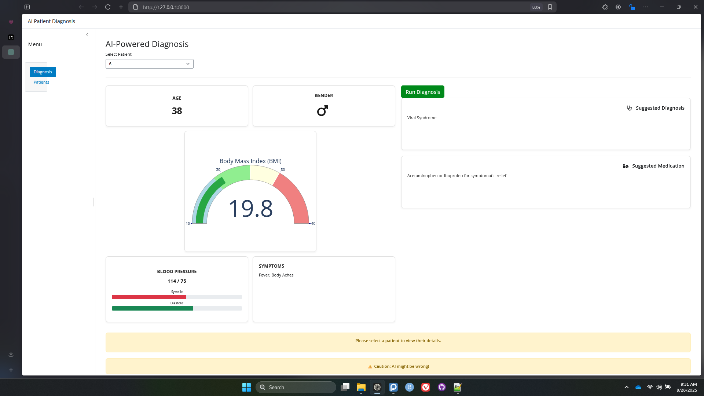
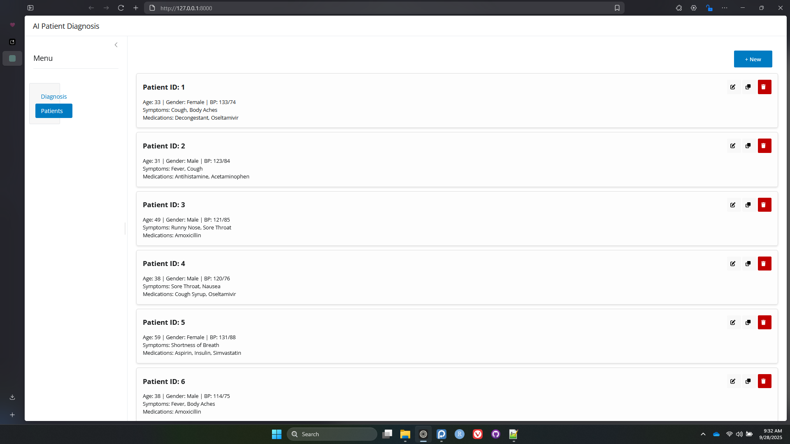
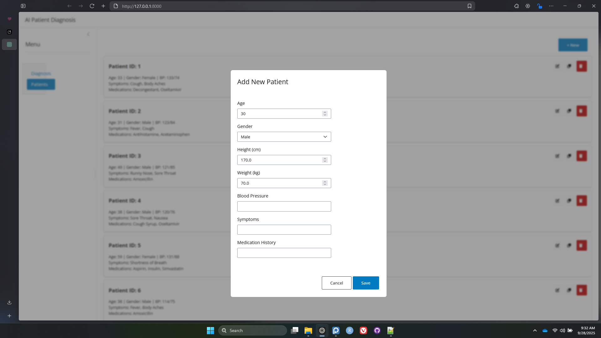

# AI Patient Diagnosis Shiny App

This project is a web-based application built with **Shiny for Python** that serves as an interactive dashboard for managing hypothetical patient records. Its core feature is the integration with **Google's Gemini API** to provide AI-powered diagnostic and medication suggestions based on patient data.

The application provides a clean, modern, and responsive user interface for data entry, visualization, and AI interaction, making it a powerful tool for demonstrating the capabilities of generative AI in a healthcare context.

## Features

-   **Full Patient Management (CRUD):**
    -   **Create:** Add new patient records through an intuitive modal form.
    -   **Read:** View all patient records in a clean, card-based layout.
    -   **Update:** Edit existing patient information seamlessly.
    -   **Delete:** Remove patient records with a confirmation step.	
-   **Interactive Diagnosis Dashboard:**
    -   Select any patient from a dropdown to view their detailed health metrics.
    -   Data is displayed in a professional, multi-column layout inspired by modern dashboard designs.
-   **Rich Data Visualization:**
    -   **BMI Gauge:** A dynamic and color-coded gauge chart, built with Plotly, visualizes the patient's Body Mass Index.
    -   **Blood Pressure:** Systolic and diastolic pressures are represented with clear progress bars.
-   **AI-Powered Suggestions:**
    -   A "Run" button sends the selected patient's complete data (Age, Gender, Symptoms, BMI, BP, etc.) to the Google Gemini API.
    -   The application parses the AI's response to display a **Suggested Diagnosis** and **Suggested Medication** in separate, clearly labeled cards.

## Screenshots

#### AI Powered Diagnosis



#### Patient List



#### Add New Data



## Technology Stack

-   **Backend & Frontend:** Python, Shiny for Python
-   **Data Manipulation:** Pandas
-   **AI Integration:** Google Generative AI SDK (`google-generativeai`)
-   **Interactive Visualizations:** Plotly, shinywidgets
-   **Icons:** Font Awesome (`faicons`)

## Setup and Installation

Follow these steps to get the application running on your local machine.

### 1. Prerequisites

-   Python 3.8 or newer.
-   A Google Gemini API key. You can get one from [Google AI Studio](https://aistudio.google.com/app/apikey).

### 2. Clone the Repository

Clone this project to your local machine:

```bash
git clone <your-repository-url>
cd <your-repository-directory>
```

### 3. Install Dependencies

It is recommended to use a virtual environment.

```bash
# Create and activate a virtual environment (optional but recommended)
python -m venv venv
source venv/bin/activate  # On Windows, use `venv\Scripts\activate`

# Install the required Python libraries
pip install shiny pandas google-generativeai plotly shinywidgets faicons
```

### 4. Set Up Your Gemini API Key

For security reasons, the application reads the API key from an environment variable. **Do not hardcode your key in the script.**

-   **On macOS/Linux:**
    ```bash
    export GOOGLE_API_KEY='YOUR_API_KEY'
    ```-   **On Windows (Command Prompt):**
    ```bash
    set GOOGLE_API_KEY='YOUR_API_KEY'
    ```
-   **On Windows (PowerShell):**
    ```powershell
    $env:GOOGLE_API_KEY='YOUR_API_KEY'
    ```

Replace `'YOUR_API_KEY'` with the actual key you obtained from Google.

### 5. Prepare Patient Data (Optional)

The application is designed to load initial data from `hypothetical_patient_data.csv`. If this file is not found, the app will start with an empty patient list, and you can add new patients directly through the UI.

The CSV should have the following columns:
`ID,Age,Gender,Height (cm),Weight (kg),BMI,BP,Symptoms,Medication History`

## How to Run the Application

Once the setup is complete, run the following command in your terminal from the project's root directory:

```bash
shiny run --reload app.py```

-   `shiny run`: Executes the Shiny application.
-   `app.py`: The name of the main Python script.
-   `--reload`: Automatically reloads the app when you save changes to the code.

Open your web browser and navigate to the local address provided in the terminal (usually `http://127.0.0.1:8000`).

## File Structure

```
.
├── app.py                      # Main Shiny application script
├── hypothetical_patient_data.csv # Sample patient data (optional)
├── README.md                   # This file
└── screenshot.png              # Screenshot of the application
```

***

### **Disclaimer**

This application is a technical demonstration and a proof-of-concept. The AI-generated diagnostic and medication suggestions are for illustrative purposes only and **should not be considered medical advice**. This tool is not intended for use in real-world medical or clinical decision-making. Always consult with a qualified healthcare professional for any health concerns.